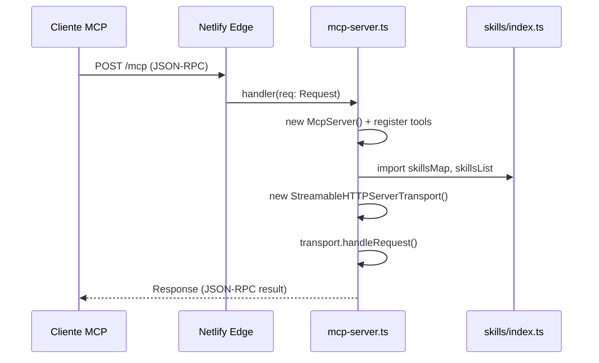

# Design Técnico — dp-createur-ptbr-astro

## Overview

Esta feature adapta os 24 skills dp-createur (originalmente em francês) para PT-BR e os expõe como um servidor MCP (Model Context Protocol) remoto, hospedado no projeto `docs-mcp` via Netlify Edge Functions.

O servidor permitirá que ferramentas de IA (Claude Code, Cursor, VS Code, Windsurf, ChatGPT) acessem os skills dp-createur como ferramentas MCP nativas em português do Brasil, sem qualquer instalação local. A comunicação ocorre via transporte Streamable HTTP usando o SDK `@modelcontextprotocol/sdk ^1.15.1`, no mesmo padrão já adotado pelo `mcp-server.ts` existente.

### Resultado final esperado

- **Endpoint:** `https://[domínio-netlify]/mcp` (POST)
- **Ferramentas MCP expostas:** 5 ferramentas (`buscar_skill_dp`, `listar_skills_dp`, `buscar_skills_por_categoria`, `obter_proximo_skill`, `buscar_skills_por_objetivo`)
- **Conteúdo:** 24 skills traduzidos e adaptados culturalmente para PT-BR, com arquivos de referência embutidos
- **Deploy:** Netlify Edge Function (Deno runtime), modo stateless, sem variáveis de ambiente necessárias

### Decisões de design

| Decisão | Escolha | Rationale |
|---------|---------|-----------|
| Armazenamento dos skills | Módulos TypeScript estáticos em `skills/` | Edge Functions têm acesso limitado ao filesystem em runtime; módulos TS são bundlados pelo Netlify e servidos com latência zero |
| Estrutura de lookup | Map (objeto TypeScript) indexado por nome | O`s requirements exigem busca O(1) por nome exato |
| Transporte MCP | Streamable HTTP stateless | Compatível com todos os clientes MCP; padrão já adotado pelo projeto |
| Separação de responsabilidades | `skills/` para dados, `mcp-server.ts` para lógica | Requisito explícito (Req 8.3); facilita manutenção e testes independentes |
| Conteúdo das referências | Embutido no registro do skill (`conteudo`) | Edge Functions não têm filesystem; bundling garante disponibilidade offline |
| Adaptação cultural | FitPro Academy → Academia FitPro, R$ 197 | Equivalência de contexto para o mercado brasileiro |

---

## Architecture

### Visão geral do fluxo



### Estrutura de arquivos

```
docs-mcp/
├── netlify/
│   └── edge-functions/
│       ├── mcp-server.ts          ← servidor MCP principal (modificado)
│       └── skills/
│           ├── index.ts           ← mapa central + lista tipada dos 24 skills
│           ├── dp-business-profile.ts
│           ├── dp-market-research.ts
│           ├── dp-competitor-analysis.ts
│           ├── dp-launch.ts
│           ├── dp-playbook-create.ts
│           ├── dp-playbook-section.ts
│           ├── dp-playbook-audit.ts
│           ├── dp-playbook-sync.ts
│           ├── dp-ebook-cover.ts
│           ├── dp-lead-magnet-create.ts
│           ├── dp-export-pdf.ts
│           ├── dp-landing-page.ts
│           ├── dp-sales-funnel.ts
│           ├── dp-copy-review.ts
│           ├── dp-tracking-setup.ts
│           ├── dp-upsell-strategy.ts
│           ├── dp-ad-angles-meta.ts
│           ├── dp-ad-angles-google.ts
│           ├── dp-blog-strategy.ts
│           ├── dp-blog-article.ts
│           ├── dp-blog-publish.ts
│           ├── dp-email-sequence.ts
│           ├── dp-social-caption.ts
│           └── dp-mediaplan.ts
├── public/
│   └── index.html                 ← landing page (existente, sem alteração)
├── deno.json                      ← imports (existente, sem alteração)
├── netlify.toml                   ← configuração de build (existente, sem alteração)
├── package.json                   ← dependências (existente, sem alteração)
└── README.md                      ← substituído por versão PT-BR
```

### Padrão de activação da Edge Function

O Netlify detecta a função via as exportações `handler` e `config` no `mcp-server.ts`, replicando exatamente o padrão existente:

```typescript
export default async function handler(req: Request): Promise<Response> { ... }
export const config: Config = { path: ["/mcp"], method: ["POST", "GET"] };
```

---

## Components and Interfaces

### 1. `skills/index.ts` — Mapa central e tipos

Este módulo exporta:
- O tipo `SkillRecord` (estrutura tipada de cada skill)
- O tipo `SkillCategory` (union type das 6 categorias)
- O mapa `skillsMap: Record<string, SkillRecord>` — lookup O(1) por nome
- A lista `skillsList: SkillRecord[]` — lista ordenada para iteração
- O mapa `workflowGraph: Record<string, WorkflowNext[]>` — grafo de próximas etapas
- O mapa `objectiveIndex: Record<string, string[]>` — índice de skills por objetivo

```typescript
// types
export type SkillCategory =
  | "Fundação"
  | "Criação do Produto"
  | "Venda e Monetização"
  | "Conteúdo e SEO"
  | "Promoção"
  | "Análise e Qualidade";

export interface SkillRecord {
  nome: string;                 // "dp-playbook-create"
  categoria: SkillCategory;
  descricao: string;            // descrição em PT-BR
  argumentHint: string;         // dica de uso do argumento
  allowedTools: string[];       // ["Read", "Write", "Bash", "Glob"]
  conteudo: string;             // conteúdo completo do SKILL.md em PT-BR
}

export interface WorkflowNext {
  skill: string;                // nome no formato dp-[nome]
  justificativa: string;        // máximo 280 caracteres, em PT-BR
}

// exports
export const skillsMap: Record<string, SkillRecord>;
export const skillsList: SkillRecord[];
export const workflowGraph: Record<string, WorkflowNext[]>;
export const objectiveIndex: Record<string, string[]>;
```

### 2. `skills/dp-[nome].ts` — Módulo de cada skill

Cada um dos 24 arquivos exporta um único objeto `SkillRecord` com o conteúdo completo do skill traduzido para PT-BR (incluindo o conteúdo dos arquivos `references/*.md` concatenados ao campo `conteudo`).

```typescript
// exemplo: skills/dp-business-profile.ts
import type { SkillRecord } from "./index.ts";

const skill: SkillRecord = {
  nome: "dp-business-profile",
  categoria: "Fundação",
  descricao: "Cria ou atualiza o arquivo business-profile.md...",
  argumentHint: "[update] — sem argumento = criação guiada, com 'update' = atualização parcial",
  allowedTools: ["Read", "Write", "Bash", "Glob"],
  conteudo: `...conteúdo completo traduzido do SKILL.md + referências...`
};

export default skill;
```

### 3. `mcp-server.ts` — Servidor MCP dp-createur PT-BR

Substitui a lógica atual do servidor Astro Docs por um novo servidor dp-createur, mantendo o mesmo padrão de exportação. **Sem variáveis de ambiente necessárias.**

```typescript
import { McpServer } from "@modelcontextprotocol/sdk/server/mcp.js";
import { StreamableHTTPServerTransport } from "@modelcontextprotocol/sdk/server/streamableHttp.js";
import { toFetchResponse, toReqRes } from "fetch-to-node";
import z from "zod";
import type { Config } from "@netlify/edge-functions";
import { skillsMap, skillsList, workflowGraph, objectiveIndex } from "./skills/index.ts";

function getServer(): McpServer {
  const server = new McpServer({ name: "DP Criador PT-BR", version: "1.0.0" });
  // registro das 5 ferramentas...
  return server;
}

export default async function handler(req: Request): Promise<Response> { ... }
export const config: Config = { path: ["/mcp"], method: ["POST", "GET"] };
```

### 4. Ferramentas MCP registradas

#### 4.1 `buscar_skill_dp`

- **Parâmetro:** `nome_skill: string` (obrigatório) — ex: `"dp-playbook-create"`
- **Sucesso:** retorna `skillsMap[nome_skill].conteudo` completo
- **Erro (não encontrado):** retorna `"Skill '<nome_skill>' não encontrado. Skills disponíveis: dp-business-profile, dp-market-research, ..."` (lista dos 24 nomes)

#### 4.2 `listar_skills_dp`

- **Parâmetros:** nenhum
- **Retorno:** lista dos 24 skills agrupados por categoria, com nome e descrição PT-BR
- **Formato de saída:**

```
## Fundação
- dp-business-profile: Cria ou atualiza o arquivo business-profile.md...
- dp-market-research: Valida uma ideia de produto digital...
...

## Criação do Produto
...
```

#### 4.3 `buscar_skills_por_categoria`

- **Parâmetro:** `categoria: string` (obrigatório) — ex: `"Fundação"`
- **Sucesso:** lista de skills da categoria com nome e descrição
- **Erro (categoria inválida):** `"Categoria não encontrada. Categorias disponíveis: Fundação, Criação do Produto, Venda e Monetização, Conteúdo e SEO, Promoção, Análise e Qualidade"`

#### 4.4 `obter_proximo_skill`

- **Parâmetro:** `skill_atual: string` (obrigatório) — ex: `"dp-business-profile"`
- **Sucesso:** lista de `WorkflowNext[]` do grafo de workflow
- **Erro (skill não encontrado ou sem sucessores):** retorna `"[]"` seguido de mensagem explicativa em PT-BR

#### 4.5 `buscar_skills_por_objetivo`

- **Parâmetro:** `objetivo: string` (obrigatório) — ex: `"criar ebook"`
- **Sucesso:** lista de skills relevantes com nome e descrição (≤280 chars)
- **Erro (nenhum skill encontrado):** retorna `"[]"` seguido de mensagem explicativa em PT-BR

---

## Data Models

### Mapeamento das 6 categorias

As categorias do requirements.md mapeiam para as categorias originais dos skills da seguinte forma:

| Categoria PT-BR | Categorias originais (SKILL.md) | Skills |
|-----------------|--------------------------------|--------|
| **Fundação** | `fondation` | `dp-business-profile`, `dp-market-research`, `dp-launch` |
| **Criação do Produto** | `creation` | `dp-playbook-create`, `dp-playbook-section`, `dp-ebook-cover`, `dp-lead-magnet-create` |
| **Venda e Monetização** | `marketing` (subset) | `dp-landing-page`, `dp-sales-funnel`, `dp-upsell-strategy` |
| **Conteúdo e SEO** | `content` | `dp-blog-strategy`, `dp-blog-article`, `dp-blog-publish`, `dp-email-sequence`, `dp-social-caption` |
| **Promoção** | `marketing` (subset) + `operations` (subset) | `dp-ad-angles-meta`, `dp-ad-angles-google`, `dp-mediaplan`, `dp-tracking-setup` |
| **Análise e Qualidade** | `production` + `operations` (subset) | `dp-playbook-audit`, `dp-playbook-sync`, `dp-export-pdf`, `dp-competitor-analysis`, `dp-copy-review` |

> Nota: as categorias originais dos SKILL.md (`fondation`, `creation`, `marketing`, `content`, `production`, `operations`) são granulares demais ou amplas demais para a interface PT-BR; o mapeamento acima as reagrupa nas 6 categorias definidas nos requirements.

### Lista completa dos 24 skills por categoria

```typescript
// Estrutura do skillsList (ordem canônica)
const SKILLS_POR_CATEGORIA = {
  "Fundação":              ["dp-business-profile", "dp-market-research", "dp-launch"],
  "Criação do Produto":    ["dp-playbook-create", "dp-playbook-section", "dp-ebook-cover", "dp-lead-magnet-create"],
  "Venda e Monetização":   ["dp-landing-page", "dp-sales-funnel", "dp-upsell-strategy"],
  "Conteúdo e SEO":        ["dp-blog-strategy", "dp-blog-article", "dp-blog-publish", "dp-email-sequence", "dp-social-caption"],
  "Promoção":              ["dp-ad-angles-meta", "dp-ad-angles-google", "dp-mediaplan", "dp-tracking-setup"],
  "Análise e Qualidade":   ["dp-playbook-audit", "dp-playbook-sync", "dp-export-pdf", "dp-competitor-analysis", "dp-copy-review"],
} as const;
// Total: 3 + 4 + 3 + 5 + 4 + 5 = 24 ✓
```

### Grafo de workflow (`workflowGraph`)

O grafo codifica o encadeamento natural entre os skills — baseado nas seções "Cross-Skill Integration" de cada SKILL.md e na lógica do `dp-launch`:

```typescript
const workflowGraph: Record<string, WorkflowNext[]> = {
  "dp-business-profile": [
    { skill: "dp-market-research", justificativa: "Com o perfil criado, valide sua ideia de produto antes de criar." }
  ],
  "dp-market-research": [
    { skill: "dp-playbook-create",     justificativa: "Validação GO: crie o ebook agora." },
    { skill: "dp-competitor-analysis", justificativa: "Aprofunde a análise competitiva antes de criar." },
    { skill: "dp-lead-magnet-create",  justificativa: "Validação TEST: crie um lead magnet para testar a demanda." }
  ],
  "dp-playbook-create": [
    { skill: "dp-playbook-audit",  justificativa: "Audite o ebook antes de exportar." },
    { skill: "dp-export-pdf",      justificativa: "Converta o ebook em PDF vendável." },
    { skill: "dp-ebook-cover",     justificativa: "Crie a capa profissional do ebook." }
  ],
  "dp-playbook-audit": [
    { skill: "dp-playbook-section", justificativa: "Corrija ou adicione seções identificadas no audit." },
    { skill: "dp-export-pdf",       justificativa: "Ebook aprovado: exporte para PDF." }
  ],
  "dp-export-pdf": [
    { skill: "dp-landing-page",     justificativa: "PDF pronto: crie a página de venda." },
    { skill: "dp-ebook-cover",      justificativa: "Crie a capa e mockup 3D para a página." },
    { skill: "dp-email-sequence",   justificativa: "Prepare a sequência de lançamento por email." }
  ],
  "dp-landing-page": [
    { skill: "dp-email-sequence",   justificativa: "Com a landing page pronta, crie a sequência de emails." },
    { skill: "dp-tracking-setup",   justificativa: "Configure o tracking antes de lançar." },
    { skill: "dp-sales-funnel",     justificativa: "Desenhe o funil completo de vendas." }
  ],
  "dp-email-sequence": [
    { skill: "dp-launch",           justificativa: "Sequência pronta: siga o checklist de lançamento." },
    { skill: "dp-ad-angles-meta",   justificativa: "Crie os anúncios Meta para o lançamento." }
  ],
  "dp-launch": [
    { skill: "dp-ad-angles-meta",   justificativa: "Lance anúncios Facebook/Instagram para escalar." },
    { skill: "dp-blog-strategy",    justificativa: "Crie conteúdo SEO para tráfego orgânico." },
    { skill: "dp-upsell-strategy",  justificativa: "Maximize o LTV com estratégia de upsell." }
  ],
  "dp-ad-angles-meta":   [{ skill: "dp-ad-angles-google", justificativa: "Complete a cobertura de mídia com Google Ads." }],
  "dp-ad-angles-google": [{ skill: "dp-tracking-setup",   justificativa: "Configure conversões para otimizar os anúncios." }],
  "dp-tracking-setup":   [{ skill: "dp-copy-review",      justificativa: "Revise os copies antes de investir em ads." }],
  "dp-blog-strategy":    [{ skill: "dp-blog-article",     justificativa: "Estratégia definida: escreva os artigos." }],
  "dp-blog-article":     [{ skill: "dp-blog-publish",     justificativa: "Artigo pronto: publique no WordPress." }],
  "dp-blog-publish":     [{ skill: "dp-social-caption",   justificativa: "Artigo publicado: crie os posts sociais." }],
  "dp-social-caption":   [{ skill: "dp-mediaplan",        justificativa: "Captions criados: monte o calendário de conteúdo." }],
  "dp-mediaplan":        [{ skill: "dp-ad-angles-meta",   justificativa: "Plano de mídia pronto: crie os anúncios." }],
  "dp-sales-funnel":     [{ skill: "dp-upsell-strategy",  justificativa: "Funil desenhado: adicione estratégia de upsell." }],
  "dp-upsell-strategy":  [{ skill: "dp-copy-review",      justificativa: "Revise o copy de upsell antes de publicar." }],
  "dp-ebook-cover":      [{ skill: "dp-export-pdf",       justificativa: "Capa criada: exporte o PDF completo." }],
  "dp-lead-magnet-create": [{ skill: "dp-landing-page",  justificativa: "Lead magnet criado: faça a página de captura." }],
  "dp-playbook-section": [{ skill: "dp-playbook-audit",  justificativa: "Seção adicionada: audite o ebook atualizado." }],
  "dp-playbook-sync":    [{ skill: "dp-export-pdf",       justificativa: "Sincronização concluída: exporte o PDF atualizado." }],
  "dp-competitor-analysis": [{ skill: "dp-playbook-create", justificativa: "Análise concluída: crie o ebook com posicionamento diferenciado." }],
  "dp-copy-review":      [{ skill: "dp-landing-page",    justificativa: "Copy aprovado: aplique na landing page." }],
};
```

### Índice de objetivos (`objectiveIndex`)

Mapa de palavras-chave/objetivos para os skills relevantes — base para `buscar_skills_por_objetivo`:

```typescript
const objectiveIndex: Record<string, string[]> = {
  "criar ebook":      ["dp-playbook-create", "dp-ebook-cover", "dp-export-pdf"],
  "criar playbook":   ["dp-playbook-create", "dp-playbook-section", "dp-ebook-cover", "dp-export-pdf"],
  "criar lead magnet": ["dp-lead-magnet-create", "dp-landing-page", "dp-email-sequence"],
  "validar ideia":    ["dp-market-research", "dp-competitor-analysis"],
  "criar página de venda": ["dp-landing-page", "dp-copy-review", "dp-tracking-setup"],
  "escrever artigo":  ["dp-blog-strategy", "dp-blog-article", "dp-blog-publish"],
  "criar anúncios":   ["dp-ad-angles-meta", "dp-ad-angles-google", "dp-tracking-setup"],
  "lançar produto":   ["dp-launch", "dp-email-sequence", "dp-ad-angles-meta"],
  "fazer email marketing": ["dp-email-sequence"],
  "aumentar vendas":  ["dp-upsell-strategy", "dp-sales-funnel", "dp-copy-review"],
  "configurar tracking": ["dp-tracking-setup"],
  "analisar concorrentes": ["dp-competitor-analysis"],
  "criar funil":      ["dp-sales-funnel", "dp-landing-page", "dp-upsell-strategy"],
  "exportar pdf":     ["dp-export-pdf"],
  "criar posts sociais": ["dp-social-caption", "dp-mediaplan"],
  "publicar wordpress": ["dp-blog-publish"],
  "sincronizar ebook": ["dp-playbook-sync"],
  "auditar ebook":    ["dp-playbook-audit", "dp-copy-review"],
  "configurar perfil": ["dp-business-profile"],
  "criar capa":       ["dp-ebook-cover"],
};
```

A busca por objetivo usa correspondência parcial — se `objetivo` está contido em alguma chave do índice, retorna os skills associados. Se nenhuma correspondência, retorna lista vazia com mensagem explicativa.

### Adaptação cultural PT-BR

| Original (FR) | Adaptado (PT-BR) |
|---------------|-----------------|
| FitPro Academy | Academia FitPro |
| Le Playbook du Coach Fitness | Playbook do Coach Fitness |
| 47€ | R$ 197 |
| euros (€) | reais (R$) |
| Gumroad, LemonSqueezy | Gumroad, Hotmart, Eduzz, Kiwify |
| ConvertKit | Brevo, RD Station, MailerLite |
| Meta Ads, Google Ads | mantidos (presença global/BR) |
| Stan Store | Hotmart, Kiwify (equiv. BR) |
| Stripe | Stripe, PagSeguro, Pagar.me |

> Elementos que não têm equivalente brasileiro claro (ex: nomes de plataformas com presença no Brasil como Notion, ClickUp, Canva) são mantidos sem alteração.

---

## Correctness Properties

*Uma propriedade é uma característica ou comportamento que deve ser verdadeiro em todas as execuções válidas de um sistema — essencialmente, uma declaração formal sobre o que o sistema deve fazer. Propriedades servem como ponte entre especificações legíveis por humanos e garantias de correção verificáveis por máquinas.*

### Property 1: Cobertura completa dos 24 skills

*Para qualquer* nome de skill no conjunto canônico dos 24 skills dp-createur, invocar `buscar_skill_dp` com esse nome deve retornar um conteúdo não vazio e diferente para cada skill.

**Validates: Requirements 1.1, 3.2**

### Property 2: Consistência do mapa de skills

*Para qualquer* skill registrado no `skillsMap`, o campo `nome` do registro deve ser igual à chave usada para indexá-lo no mapa.

**Validates: Requirements 4.3**

### Property 3: Cobertura de categorias

*Para qualquer* skill em `skillsList`, a sua `categoria` deve pertencer às seis categorias válidas, e agrupando todos os skills por categoria os totais por grupo devem ser exatamente: Fundação=3, Criação do Produto=4, Venda e Monetização=3, Conteúdo e SEO=5, Promoção=4, Análise e Qualidade=5.

**Validates: Requirements 3.5**

### Property 4: Completude dos campos obrigatórios

*Para qualquer* skill em `skillsList`, todos os campos obrigatórios (`nome`, `categoria`, `descricao`, `argumentHint`, `allowedTools`, `conteudo`) devem estar presentes e não-vazios.

**Validates: Requirements 4.5**

### Property 5: Integridade do grafo de workflow

*Para qualquer* aresta `(A → B)` em `workflowGraph`, tanto `A` quanto `B` devem ser nomes de skills válidos que existem em `skillsMap`, e o campo `justificativa` deve ter no máximo 280 caracteres.

**Validates: Requirements 7.1, 7.3**

### Property 6: Consistência do índice de objetivos

*Para qualquer* entrada em `objectiveIndex`, todos os skills listados como valor devem existir em `skillsMap`.

**Validates: Requirements 7.4**

### Property 7: Unicidade dos nomes de skills

*Para qualquer* par de skills distintos em `skillsList`, seus campos `nome` devem ser diferentes.

**Validates: Requirements 1.1, 4.3**

---

## Error Handling

### Erros de invocação de ferramentas MCP

| Cenário | Comportamento |
|---------|---------------|
| `buscar_skill_dp` com nome desconhecido | Retorna mensagem PT-BR listando os 24 skills válidos — HTTP 200, não lança exceção |
| `buscar_skills_por_categoria` com categoria inválida | Retorna mensagem PT-BR listando as 6 categorias válidas — HTTP 200 |
| `obter_proximo_skill` com skill desconhecido | Retorna `"[]"` + mensagem explicativa PT-BR — HTTP 200 |
| `buscar_skills_por_objetivo` sem correspondência | Retorna `"[]"` + mensagem explicativa PT-BR — HTTP 200 |
| Falha ao agrupar skills por categoria | HTTP 500 com `{"content": [{"type": "text", "text": "Erro ao agrupar skills por categoria: <detalhe>"}]}` |

### Erros do servidor HTTP

| Cenário | Comportamento |
|---------|---------------|
| GET em `/mcp` | HTTP 405 com header `Allow: POST` e body `"Method Not Allowed"` |
| Method MCP não reconhecido (JSON-RPC -32601) | HTTP 200 com payload JSON-RPC de erro `{"code": -32601, "message": "Method not found"}` |
| Exceção não tratada no handler | HTTP 500 com `{"content": [{"type": "text", "text": "<mensagem de erro>"}]}` |
| Skill não pode ser carregado em runtime | Log no console com nome do skill; resposta de erro PT-BR ao cliente; demais ferramentas permanecem acessíveis |

### Estratégia de tratamento (padrão)

```typescript
export default async function handler(req: Request): Promise<Response> {
  if (req.method === "GET") {
    return new Response("Method Not Allowed", {
      status: 405,
      headers: { "Content-Type": "text/plain", Allow: "POST" },
    });
  }
  try {
    // lógica MCP stateless...
  } catch (error) {
    const msg = error instanceof Error ? error.message : String(error);
    console.error("Erro no servidor MCP dp-createur:", msg);
    return Response.json(
      { content: [{ type: "text", text: msg }] },
      { status: 500 }
    );
  }
}
```

---

## Testing Strategy

### Avaliação de aplicabilidade de PBT

Esta feature envolve:
- Dados estáticos (conteúdo dos 24 skills em módulos TypeScript)
- Funções de lookup e filtragem sobre estruturas em memória
- Uma Edge Function que é essencialmente um wrapper HTTP sobre o SDK MCP

As propriedades mais importantes são **invariantes estruturais** dos dados (completude, unicidade, cobertura de categorias) e **propriedades do grafo de workflow** (integridade das arestas). Essas são adequadas para property-based testing porque:
- O espaço de entrada é finito e gerado (subsets dos 24 skills, nomes de categorias, objetivos)
- O comportamento deve ser universal (vale para qualquer skill, não apenas exemplos específicos)
- 100 iterações encontrariam regressões introduzidas por edições nos dados

### Ferramentas

- **Property-based testing:** [fast-check](https://github.com/dubzzz/fast-check) via Deno (`npm:fast-check`)
- **Test runner:** `deno test`
- **Mocking:** não necessário (dados são módulos em memória)

### Estrutura dos testes

```
netlify/edge-functions/
└── skills/
    └── __tests__/
        ├── skills.property.test.ts   ← property-based tests (fast-check)
        └── server.unit.test.ts       ← unit tests (exemplos e edge cases)
```

### Testes unitários (exemplos e edge cases)

**`server.unit.test.ts`**

| Teste | Tipo | Requisito |
|-------|------|-----------|
| GET /mcp retorna 405 com header Allow: POST | Exemplo | 1.4 |
| POST com method MCP inválido retorna JSON-RPC -32601 | Exemplo | 1.5 |
| `buscar_skill_dp("dp-playbook-create")` retorna conteúdo PT-BR | Exemplo | 3.2 |
| `buscar_skill_dp("dp-inexistente")` retorna mensagem com lista dos 24 | Exemplo | 3.3 |
| `listar_skills_dp()` retorna 24 skills agrupados em 6 categorias | Exemplo | 3.5 |
| `buscar_skills_por_categoria("Fundação")` retorna 3 skills | Exemplo | 3.7 |
| `buscar_skills_por_categoria("Inexistente")` retorna mensagem com 6 categorias | Exemplo | 3.8 |
| `obter_proximo_skill("dp-business-profile")` inclui dp-market-research | Exemplo | 7.2 |
| `obter_proximo_skill("dp-export-pdf")` retorna múltiplos sucessores | Exemplo | 7.3 |
| `buscar_skills_por_objetivo("criar ebook")` retorna dp-playbook-create, dp-ebook-cover, dp-export-pdf | Exemplo | 7.5 |
| `obter_proximo_skill("dp-inexistente")` retorna `[]` + mensagem PT-BR | Edge case | 7.6 |
| `buscar_skills_por_objetivo("objetivo sem resultado")` retorna `[]` + mensagem PT-BR | Edge case | 7.6 |
| Conteúdo de skill não contém texto em francês após tradução | Edge case | 2.1 |
| Conteúdo de skill não contém "FitPro Academy" (substituído por "Academia FitPro") | Edge case | 2.5 |
| Conteúdo de skill não contém "47 euros" ou "47€" (substituído por "R$ 197") | Edge case | 2.5 |

### Testes de propriedades (fast-check)

**`skills.property.test.ts`**

Cada property-based test roda mínimo 100 iterações.

```typescript
// Tag format: Feature: dp-createur-ptbr-astro, Property N: <descrição>
import fc from "fast-check";
import { skillsMap, skillsList, workflowGraph, objectiveIndex } from "../index.ts";
```

**Property 1: Cobertura completa dos 24 skills**
- Gera: nome de skill a partir da lista de 24 nomes canônicos
- Verifica: `skillsMap[nome]` existe e `.conteudo` não está vazio e é diferente entre skills
- Tag: `Feature: dp-createur-ptbr-astro, Property 1: cobertura completa dos 24 skills`

**Property 2: Consistência do mapa de skills**
- Gera: chave aleatória de `skillsMap`
- Verifica: `skillsMap[chave].nome === chave`
- Tag: `Feature: dp-createur-ptbr-astro, Property 2: consistência do mapa de skills`

**Property 3: Cobertura de categorias**
- Gera: subconjunto aleatório de `skillsList`
- Verifica: toda `categoria` é uma das 6 válidas; agrupamento total resulta em 24 skills e distribuição correta
- Tag: `Feature: dp-createur-ptbr-astro, Property 3: cobertura de categorias`

**Property 4: Completude dos campos obrigatórios**
- Gera: skill aleatório de `skillsList`
- Verifica: todos os 6 campos obrigatórios presentes e não-vazios
- Tag: `Feature: dp-createur-ptbr-astro, Property 4: completude dos campos obrigatórios`

**Property 5: Integridade do grafo de workflow**
- Gera: aresta aleatória de `workflowGraph`
- Verifica: nó de origem e destino existem em `skillsMap`; `justificativa.length <= 280`
- Tag: `Feature: dp-createur-ptbr-astro, Property 5: integridade do grafo de workflow`

**Property 6: Consistência do índice de objetivos**
- Gera: entrada aleatória de `objectiveIndex`
- Verifica: todos os skills listados existem em `skillsMap`
- Tag: `Feature: dp-createur-ptbr-astro, Property 6: consistência do índice de objetivos`

**Property 7: Unicidade dos nomes de skills**
- Gera: par aleatório de skills distintos de `skillsList`
- Verifica: `skillA.nome !== skillB.nome`
- Tag: `Feature: dp-createur-ptbr-astro, Property 7: unicidade dos nomes de skills`

### Testes de integração (manuais/CI)

Os seguintes cenários devem ser verificados após o deploy na Netlify, mas não como testes automatizados de PBT (envolvem infra externa):

| Verificação | Como testar |
|-------------|-------------|
| Handshake MCP via Claude Code | `claude mcp add --transport http "DP Criador PT-BR" https://[url]/mcp` |
| Handshake via Cursor/VS Code | Adicionar `{"url": "https://[url]/mcp"}` ao config MCP |
| Handshake via Windsurf (proxy) | `npx mcp-remote https://[url]/mcp` |
| 24 ferramentas listadas no handshake | Inspecionar campo `tools` da resposta de inicialização |
